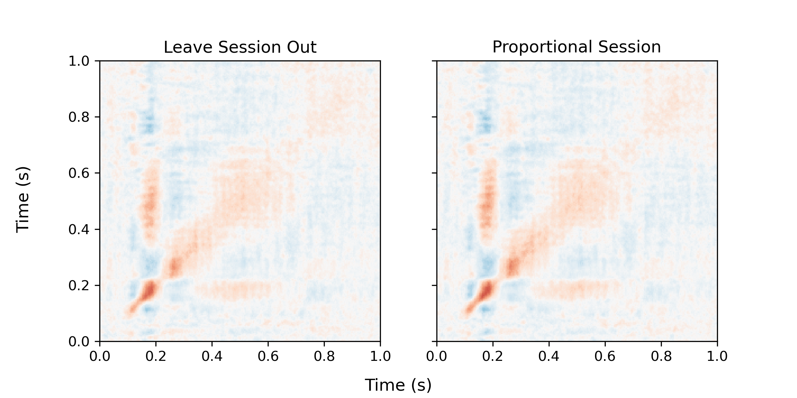

## About the project

The aim of this project was to investigate how different cross-validation schemes influence decoding accuracy on MEG data given the variablitity within the data.

### Preprocessing
The preprocessing of the MEG data is done using MNE-python. 

### Decoding
The decoding is done using linear discriminant analysis (LDA). It relies on the scikit-learn library.

### Project Organization
```
├── README.md                           <- The top-level README for this project.                 
├── source_reconstruction               <- Scripts and files used for source reconstruction
│   ├── hpi_mri.mat                     <- Mat file containing the MRI positions of the HPI
│   ├── epochs_2_source_space.py
│   └── source_space.py                 <- Setting up source space and BEM
├── decoding                            <- Scripts and information used for decoding
│   ├── hpi_mri.mat 
│   ├── plots    
├── ERF_analysis                        <- Scripts and information used for ERF analysis
│   ├── data 
│   │   ├── xbin_grad.npz
│   │   ├── ybin_grad.npy
│   │   ├── ybin_seshindsgrad.npy
│   │   └── ...
│   ├── plots                           <- Directory for saving plots
│   ├── erf_plotting.py                 <- Function for creating plots of ERFs
│   └── prep_data.py                    <- Prepares the data for ERF analysis
├── preprocessing                       <- Scripts for preprocessing of the data
│   ├── check_ica.ipynb                 <- Plotting of the ICA components
│   └── run_ica.ipynb                   <- Running ICA on the data
├── decoding
│   ├── accuracies                      <- Directory for saving decoding accuracies
│   │   ├── accuracies_LDA_prop.npy
│   │   └── accuracies_LDA_lbo.np
│   ├── decoder_animacy.py              <- Decoder class used for decoding
│   ├── decoding_source.py              <- Script running the decoding analysis
│   ├── prep_data.py                    <- Prepares the data for decoding analysis
│   └── statistics.py                   <- Mixed effects linear modelling of accuracy
├── envirionment.yml                    <- Packages in the conda environment used
├── event_session_info.py               <- Creates event_ids.txt and session_info.py
├── event_ids.txt                       <- Mapping of the stimuli to the triggers
└── session_info.txt                    <- Bad channels, ICA noise components, etc. per session
```

## Preprocessing pipeline for each session
| Do | File | Notes |
|-----------|:------------|:--------|
Identify bad channels, tmin and tmax | ```CURRENTLY EMPTY``` | Add the channels, tmin and tmax to ```event_session_info.py```
Run ICA | ```preprocessing/run_ica.py``` | 
Identify noise components and create epochs | ```preprocessing/check_ica.ipynb``` | Add noise components to ```event_session_info.py```
Source reconstruction | ```source_reconstruction/epochs_2_source_space.py``` | 

