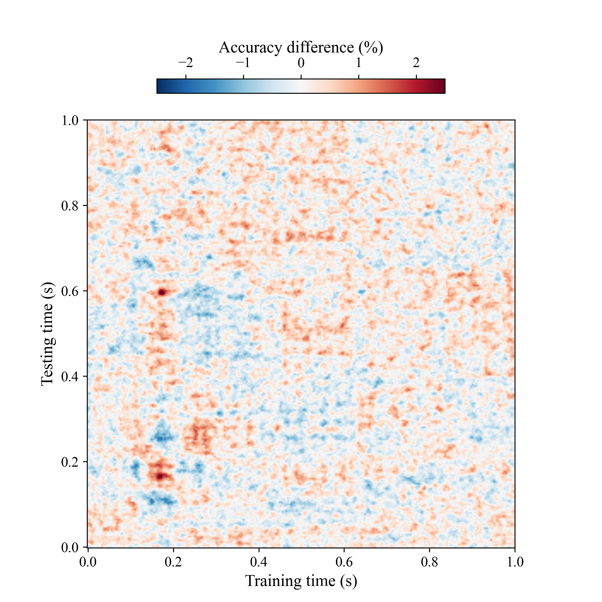

## About the project
The aim of this project is to investigate how different cross-validation schemes influence decoding accuracy on MEG data in source space given the variablitity within the data.


### Data
The data used for this project contains of MEG data from one participant being subject to visual stimuli. The data was recorded over 7 different days with the same stimuli. The stimuli were either animate or inanimate.

### Preprocessing
The preprocessing of the MEG data is done using MNE-python. 

### Decoding
The decoding is done using linear discriminant analysis (LDA). It relies on the scikit-learn library.

### Project Organization
```
├── README.md                           <- The top-level README for this project.  
├── decoding
│   ├── accuracies                      <- Directory for saving decoding accuracies
│   │   ├── accuracies_LDA_prop.npy
│   │   └── ...
│   ├── plots                           <- Directory for saving plots
│   ├── cross_decoding.py               <- Script running the cross decoding
│   ├── decoder_animacy.py              <- Decoder class used for within session decoding
│   ├── decoder_cross.py                <- Decoder class used for cross decoding
│   ├── decoding.py                     <- Script running the within session decoding
│   ├── decoding_plots.py               <- Script generating plots of decoding accuracy
│   └── statistics.py                   <- statistical analysis of decoding accuracy              
├── ERF_analysis                        <- Scripts and information used for ERF analysis
│   ├── plots                           <- Directory for saving plots
│   └── erf.py                          <- Generate plots of ERFs and saves the standard deviation of the ERFs needed for the decoding analysis
├── preprocessing                       <- Scripts for preprocessing of the data
│   ├── check_ica.ipynb                 <- Plotting of the ICA components
│   └── run_ica.ipynb                   <- Running ICA on the data
├── source_reconstruction               <- Scripts and files used for source reconstruction
│   ├── epochs_2_source_space.py
│   ├── hpi_mri.mat                     <- Mat file containing the MRI positions of the HPI
│   └── source_space.py                 <- Setting up source space and BEM
├── subset_data
│   ├── data                            <- Directory for saving the subset data
│   └── prep_data.py                    <- Script preparing data subset in source and sensor space
├── event_session_info.py               <- Creates event_ids.txt and session_info.py
├── event_ids.txt                       <- Mapping of the stimuli to the triggers
└── session_info.txt                    <- Bad channels, ICA noise components, etc. per session
```

## Preprocessing pipeline for each session
| Do | File | Notes |
|-----------|:------------|:--------|
Identify bad channels, tmin and tmax | ```CURRENTLY EMPTY``` | Add the channels, tmin and tmax to ```event_session_info.py```. Remember to run ```event_session_info.py``` after changing the values.
Run ICA | ```preprocessing/run_ica.py``` | 
Identify noise components and create epochs | ```preprocessing/check_ica.ipynb``` | Add noise components to ```event_session_info.py```
Source reconstruction | ```source_reconstruction/epochs_2_source_space.py``` | 

## ERF workflow
| Do | File | Notes |
|-----------|:------------|:--------|
Prepare data for analysis | ```subset_data/prep_data.py``` | 
Generate plots of ERFs and save standard deviations | ```ERF_analysis/erf.py``` |


## Decoding workflow
| Do | File | Notes |
|-----------|:------------|:--------|
Prepare data for decoding | ```subset_data/prep_data.py``` | Is not needed if you already have the subset data from the ERF analysis, as both analyses use the same subset data
Within session decoding | ```decoding/decoding_source.py``` |
Cross decoding | ```decoding/decoding_across_sessions.py``` | Use flag to indicate whether you want to do it in source- or sensor space
Statistics | ```decoding/statistics.py``` |
Generate plots of decoding accuracy | ```decoding/plots.py``` |